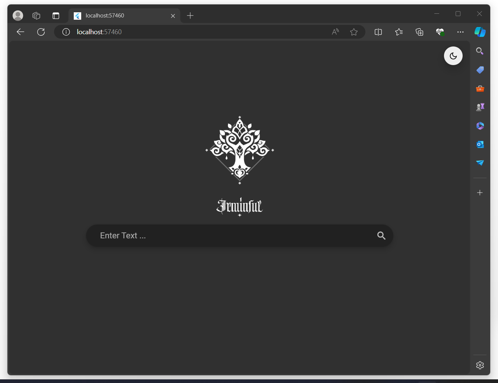

<a name="readme-top"></a>

[![Contributors][contributors-shield]][contributors-url]
[![Forks][forks-shield]][forks-url]
[![Stargazers][stars-shield]][stars-url]
[![Issues][issues-shield]][issues-url]
[![MIT License][license-shield]][license-url]

[contributors-shield]: https://img.shields.io/github/contributors/AbdoWise-z/Irminsul-ui?style=for-the-badge
[contributors-url]: https://github.com/AbdoWise-z/Irminsul-ui/graphs/contributors

[forks-shield]: https://img.shields.io/github/forks/AbdoWise-z/Irminsul-ui?style=for-the-badge
[forks-url]: https://github.com/AbdoWise-z/Irminsul-ui/network/members

[stars-shield]: https://img.shields.io/github/stars/AbdoWise-z/Irminsul-ui?style=for-the-badge
[stars-url]: https://github.com/AbdoWise-z/Irminsul-ui/stargazers

[issues-shield]: https://img.shields.io/github/issues/AbdoWise-z/Irminsul-ui?style=for-the-badge
[issues-url]: https://github.com/AbdoWise-z/Irminsul-ui/issues

[license-shield]: https://img.shields.io/github/license/AbdoWise-z/Irminsul-ui?style=for-the-badge
[license-url]: https://github.com/AbdoWise-z/Irminsul-ui/blob/master/LICENSE.txt

<!-- PROJECT LOGO -->
<br />
<div align="center">
  <a href="https://github.com/AbdoWise-z/Irminsul-ui">
    
  </a>

<h3 align="center">Irminsul</h3>
  <p align="center">
    The UI repo of the Irminsul search engine project.
    <br />
    <br />
    <a href="https://github.com/AbdoWise-z/Irminsul-ui/tree/main/cpu"><strong>Explore</strong></a>
    <br />
    <a href="https://github.com/AbdoWise-z/Irminsul-ui/tree/main/assembler">Assembler</a>
    ·
    <a href="https://github.com/AbdoWise-z/Irminsul-ui/tree/main/images">Images</a>
    ·
    <a href="https://github.com/AbdoWise-z/Irminsul-ui/issues">Request Feature</a>
  </p>
</div>

<!-- TABLE OF CONTENTS -->
## Table of Contents
<ol>
  <li>
    <a href="#about-the-project">About The Project</a>
    <ul>
      <li><a href="#built-with">Built With</a></li>
      <li><a href="#features">Features</a></li>
    </ul>
  </li>
  <li>
    <a href="#getting-started">Getting Started</a>
  </li>
  <li><a href="#gallery">Gallery</a></li>
  <li><a href="#contributing">Contributing</a></li>
  <li><a href="#license">License</a></li>
  <li><a href="#contact">Contact</a></li>
</ol>

<!-- ABOUT THE PROJECT -->
## About The Project

This is the front-end repo of the Irminsul search engine project. This repo features an example of a wrapper that can be built
on top of the Irminsul backend to provide users with visual UI for the search engine.

### Built With

The project was divided into two parts
* Part 1: The <a herf="https://github.com/AbdoWise-z/Irminsul-backend">backend server</a>, Written in Java | Spring Boot
* Part 2: The UI, Written in Dart | Flutter


<p align="right">(<a href="#readme-top">back to top</a>)</p>

## Features
This UI implementation providers various features, such as:
* Rich Ui visuals.
* Suggestions for search inputs.
* Light / Dark themes
* Highlighting for paragraphs matching the search
* and more..


<!-- GETTING STARTED -->
## Getting Started
Before you begin, ensure you have the following installed on your local machine:

- **Flutter SDK**: Ensure Flutter SDK is installed on your machine. You can follow the installation instructions on flutter.dev.
- **IDE**: Use an IDE with Flutter support, such as Android Studio, IntelliJ IDEA, or Visual Studio Code.
- **Git**: Install Git to clone the repository if you haven't already. You can download Git from git-scm.com.

#### Steps
1. Clone the Repository
```bash
git clone https://github.com/AbdoWise-z/Irminsul-ui.git
cd Irminsul-ui
```
2. Open the Project in Your IDE
    * Open Android Studio, IntelliJ IDEA, or Visual Studio Code.
    * Navigate to the cloned 'Irminsul-ui' directory and open it as a Flutter project.

3. Install Dependencies
    * If using Visual Studio Code, open a terminal and run:
      ```
      flutter pub get
      ```
    * If using Android Studio or IntelliJ IDEA, you can click "Packages get" when prompted or run flutter pub get in the terminal.
4. Run the App
    * In your IDE, run the project (flutter run) or use the command line:
      ```
      flutter run
      ```
    * This command compiles the Flutter project and launches the app on your connected device or emulator.
5. Explore and Modify
    * Navigate through the project structure (lib/) to understand its organization.
    * The main entry point of the app is typically located in lib/main.dart.


<p align="right">(<a href="#readme-top">back to top</a>)</p>

## Gallery
<table align="cetner">
<div align="center">

</div>
<td>

</td>
<td>

</td>
</table>

<div align="center">
<p>Different Themes</p>
</div>
<p align="right">(<a href="#readme-top">back to top</a>)</p>

<div align="center">

<p>Theme switching</p>
</div>
<p align="right">(<a href="#readme-top">back to top</a>)</p>

<div align="center">

<p>Searching</p>
</div>
<p align="right">(<a href="#readme-top">back to top</a>)</p>

<div align="center">

<p>Usage Example</p>
</div>
<p align="right">(<a href="#readme-top">back to top</a>)</p>

<!-- CONTRIBUTING -->
## Contributing

Contributions are what make the open source community such an amazing place to learn, inspire, and create. Any contributions you make are **greatly appreciated**.

This project was developed by
<table>
<tr>

<td align="center">
<a href="https://github.com/AbdoWise-z" target="_black">
<br /><sub><b>Abdulrahman Mohammed</b></sub> <br/></a>
</td>

<td align="center">
<a href="https://github.com/Elkapeer" target="_black">
<br /><sub><b>Osama Saleh</b></sub><br/></a>
</td>

<td align="center">
<a href="https://github.com/amr-salahuddin" target="_black">
<br /><sub><b>Amr Salahuddin</b></sub><br/></a>
</td>

<td align="center">
<a href="https://github.com/Hefney" target="_black">
<br /><sub><b>Abdulrahman Hefney</b></sub><br/></a>
</td>

</tr>
 </table>

If you have a suggestion that would make this better, please fork the repo and create a pull request. You can also simply open an issue with the tag "enhancement".
Don't forget to give the project a star! Thanks again!

1. Fork the Project
2. Create your Feature Branch (`git checkout -b feature/AmazingFeature`)
3. Commit your Changes (`git commit -m 'Add some AmazingFeature'`)
4. Push to the Branch (`git push origin feature/AmazingFeature`)
5. Open a Pull Request

<p align="right">(<a href="#readme-top">back to top</a>)</p>

<!-- LICENSE -->
## License

Distributed under the MIT License. See `LICENSE.txt` for more information.

<p align="right">(<a href="#readme-top">back to top</a>)</p>

<!-- CONTACT -->
## Contact

[Abdulrahman Mohammed Abdulfattah](https://www.linkedin.com/in/abdo-mohamed-5b3506252/) - <moh2002.abdow@gmail.com>

<p align="right">(<a href="#readme-top">back to top</a>)</p>

<!--difiniations -->